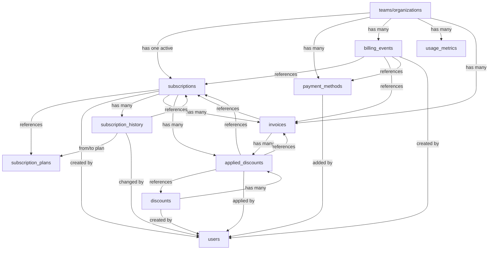

# Billing Database Schema Documentation

## Overview
The billing system uses 10 interconnected tables to manage subscriptions, payments, invoices, and usage tracking for the Sekuriti.io platform.

## Database Tables Structure

### 1. **subscription_plans** (Master Plan Catalog)
```sql
┌─────────────────────────────────────┐
│        subscription_plans           │
├─────────────────────────────────────┤
│ id (PK)                             │
│ name: varchar(100)                  │
│ display_name: varchar(100)          │
│ description: text                   │
│ type: enum (free/standard/pro/...)  │
│ monthly_price: decimal(10,2)        │
│ yearly_price: decimal(10,2)         │
│ setup_fee: decimal(10,2)            │
│ currency: varchar(3)                │
│ stripe_monthly_price_id: varchar    │
│ stripe_yearly_price_id: varchar     │
│ stripe_product_id: varchar          │
│ max_users: integer                  │
│ max_incidents: integer              │
│ max_assets: integer                 │
│ max_runbooks: integer               │
│ max_storage_gb: integer             │
│ features: jsonb                     │
│ trial_days: integer                 │
│ is_active: boolean                  │
│ is_public: boolean                  │
│ sort_order: integer                 │
│ metadata: jsonb                     │
│ created_at: timestamp               │
│ updated_at: timestamp               │
└─────────────────────────────────────┘
```
**Purpose**: Stores all available subscription plans with their features, limits, and pricing.

### 2. **subscriptions** (Active Subscriptions)
```sql
┌─────────────────────────────────────┐
│          subscriptions              │
├─────────────────────────────────────┤
│ id (PK)                             │
│ organization_id (FK -> teams.id)    │
│ plan_id (FK -> subscription_plans)  │
│ status: enum (active/canceled/...)  │
│ billing_interval: enum              │
│ price: decimal(10,2)                │
│ currency: varchar(3)                │
│ stripe_subscription_id: varchar     │
│ stripe_customer_id: varchar         │
│ stripe_price_id: varchar            │
│ start_date: timestamp               │
│ current_period_start: timestamp     │
│ current_period_end: timestamp       │
│ canceled_at: timestamp              │
│ cancelation_reason: text            │
│ ended_at: timestamp                 │
│ trial_start: timestamp              │
│ trial_end: timestamp                │
│ created_by (FK -> users.id)         │
│ metadata: jsonb                     │
│ created_at: timestamp               │
│ updated_at: timestamp               │
└─────────────────────────────────────┘
```
**Purpose**: Tracks current subscription for each organization with billing details and status.

### 3. **subscription_history**
```sql
┌─────────────────────────────────────┐
│       subscription_history          │
├─────────────────────────────────────┤
│ id (PK)                             │
│ subscription_id (FK)                │
│ organization_id (FK)                │
│ event: varchar(50)                  │
│ from_plan_id (FK)                   │
│ to_plan_id (FK)                     │
│ from_price: decimal(10,2)           │
│ to_price: decimal(10,2)             │
│ changed_by (FK -> users.id)         │
│ reason: text                        │
│ metadata: jsonb                     │
│ created_at: timestamp               │
└─────────────────────────────────────┘
```
**Purpose**: Audit trail of all subscription changes (upgrades, downgrades, cancellations).

### 4. **invoices**
```sql
┌─────────────────────────────────────┐
│            invoices                 │
├─────────────────────────────────────┤
│ id (PK)                             │
│ organization_id (FK)                │
│ subscription_id (FK)                │
│ invoice_number: varchar(100)        │
│ status: enum (pending/succeeded...) │
│ subtotal: decimal(10,2)             │
│ tax: decimal(10,2)                  │
│ discount: decimal(10,2)             │
│ total: decimal(10,2)                │
│ currency: varchar(3)                │
│ stripe_invoice_id: varchar          │
│ stripe_payment_intent_id: varchar   │
│ stripe_pdf_url: text                │
│ issued_at: timestamp                │
│ due_date: timestamp                 │
│ paid_at: timestamp                  │
│ voided_at: timestamp                │
│ line_items: jsonb                   │
│ metadata: jsonb                     │
│ created_at: timestamp               │
│ updated_at: timestamp               │
└─────────────────────────────────────┘
```
**Purpose**: Records all invoices with payment status and amounts.

### 5. **payment_methods**
```sql
┌─────────────────────────────────────┐
│         payment_methods             │
├─────────────────────────────────────┤
│ id (PK)                             │
│ organization_id (FK)                │
│ type: varchar(50)                   │
│ is_default: boolean                 │
│ brand: varchar(50)                  │
│ last4: varchar(4)                   │
│ exp_month: integer                  │
│ exp_year: integer                   │
│ bank_name: varchar(100)             │
│ account_last4: varchar(4)           │
│ stripe_payment_method_id: varchar   │
│ added_by (FK -> users.id)           │
│ metadata: jsonb                     │
│ created_at: timestamp               │
│ updated_at: timestamp               │
└─────────────────────────────────────┘
```
**Purpose**: Stores payment methods (cards, bank accounts) for each organization.

### 6. **billing_events**
```sql
┌─────────────────────────────────────┐
│         billing_events              │
├─────────────────────────────────────┤
│ id (PK)                             │
│ organization_id (FK)                │
│ event_type: varchar(100)            │
│ event_source: varchar(50)           │
│ subscription_id (FK)                │
│ invoice_id (FK)                     │
│ payment_method_id (FK)              │
│ stripe_event_id: varchar            │
│ data: jsonb                         │
│ user_id (FK)                        │
│ created_at: timestamp               │
└─────────────────────────────────────┘
```
**Purpose**: Comprehensive audit log of all billing activities and webhook events.

### 7. **usage_metrics**
```sql
┌─────────────────────────────────────┐
│          usage_metrics              │
├─────────────────────────────────────┤
│ id (PK)                             │
│ organization_id (FK)                │
│ metric_type: varchar(50)            │
│ metric_value: integer               │
│ metric_unit: varchar(20)            │
│ period_start: timestamp             │
│ period_end: timestamp               │
│ is_billable: boolean                │
│ cost: decimal(10,2)                 │
│ metadata: jsonb                     │
│ created_at: timestamp               │
└─────────────────────────────────────┘
```
**Purpose**: Tracks usage data for usage-based billing (API calls, storage, etc.).

### 8. **discounts**
```sql
┌─────────────────────────────────────┐
│           discounts                 │
├─────────────────────────────────────┤
│ id (PK)                             │
│ code: varchar(50) UNIQUE            │
│ name: varchar(100)                  │
│ description: text                   │
│ type: varchar(20)                   │
│ value: decimal(10,2)                │
│ applies_to_plans: jsonb             │
│ minimum_amount: decimal(10,2)       │
│ max_uses: integer                   │
│ current_uses: integer               │
│ max_uses_per_organization: integer  │
│ valid_from: timestamp               │
│ valid_until: timestamp              │
│ stripe_coupon_id: varchar           │
│ is_active: boolean                  │
│ metadata: jsonb                     │
│ created_by (FK)                     │
│ created_at: timestamp               │
│ updated_at: timestamp               │
└─────────────────────────────────────┘
```
**Purpose**: Manages discount codes and coupons.

### 9. **applied_discounts**
```sql
┌─────────────────────────────────────┐
│        applied_discounts            │
├─────────────────────────────────────┤
│ id (PK)                             │
│ discount_id (FK)                    │
│ organization_id (FK)                │
│ subscription_id (FK)                │
│ invoice_id (FK)                     │
│ applied_amount: decimal(10,2)       │
│ applied_by (FK -> users.id)         │
│ applied_at: timestamp               │
└─────────────────────────────────────┘
```
**Purpose**: Tracks which discounts have been applied to subscriptions/invoices.

## Relationships Diagram



## Key Features

### 1. Multi-tenancy
- All billing data is scoped to `organization_id` (teams table)
- Each organization can have one active subscription

### 2. Subscription Management
- **Plans**: Predefined tiers (Standard, Professional, Enterprise)
- **Status tracking**: active, canceled, past_due, trialing, etc.
- **Billing intervals**: Monthly or yearly
- **Trial periods**: Configurable per plan

### 3. Payment Processing
- **Stripe Integration**: All tables have Stripe ID fields
- **Payment Methods**: Support for cards and bank accounts
- **Invoice Generation**: Automatic tracking of all charges

### 4. Usage Tracking
- **Metrics**: API calls, storage, incidents, etc.
- **Billing Impact**: Can mark metrics as billable/non-billable
- **Period-based**: Track usage over time periods

### 5. Audit Trail
- **billing_events**: Comprehensive log of all activities
- **subscription_history**: Track all plan changes
- **User tracking**: Know who made each change

### 6. Discounts & Promotions
- **Flexible discounts**: Percentage or fixed amount
- **Usage limits**: Control max uses overall and per organization
- **Plan-specific**: Can restrict to certain plans

## Data Flow

1. **Organization signs up** → Creates subscription record
2. **Monthly/yearly billing** → Generates invoice
3. **Payment processed** → Updates invoice status, creates billing_event
4. **Usage tracked** → Records in usage_metrics
5. **Plan changes** → Updates subscription, creates history record
6. **Discount applied** → Creates applied_discount record

## Sample Queries

### Get current MRR (Monthly Recurring Revenue)
```sql
SELECT SUM(
  CASE
    WHEN billing_interval = 'monthly' THEN price
    ELSE price / 12
  END
) as mrr
FROM subscriptions
WHERE status = 'active';
```

### Get organization's billing history
```sql
SELECT * FROM invoices
WHERE organization_id = ?
ORDER BY created_at DESC;
```

### Track usage for billing
```sql
SELECT metric_type, SUM(metric_value) as total
FROM usage_metrics
WHERE organization_id = ?
  AND period_start >= ?
  AND is_billable = true
GROUP BY metric_type;
```

## Security Considerations

1. **Sensitive data**: Only last 4 digits of cards stored
2. **Stripe tokens**: Used for actual payment processing
3. **Audit trail**: All changes tracked with user ID
4. **Access control**: All queries filtered by organization_id